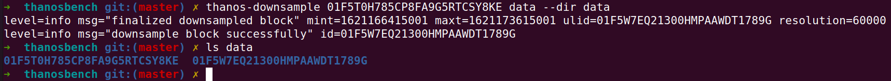

# thanos-downsample

Perform a downsampling against one specified TSDB block. Used for testing only.

## Usage

```
usage: thanos-downsample [<flags>] <block id> [<db path>]

Flags:
  -h, --help        Show context-sensitive help (also try --help-long and --help-man).
      --version     Show application version.
      --res=300000  Downsample resolution (default is 5m)
      --dir="/tmp/thanos-downsample"  
                    Directory for downsampling

Args:
  <block id>   Block to downsample
  [<db path>]  Database path (default is data/).

```

Build it.

```
make build
```

## Example


